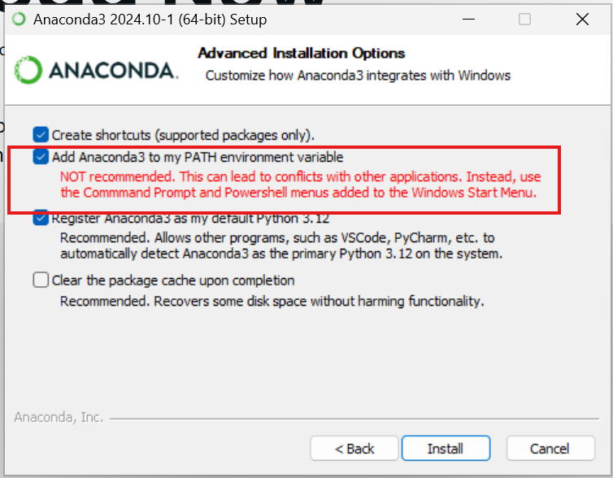
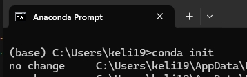
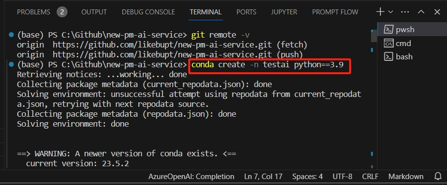

#  New PM onboarding Azure AI services

This repo helps you onboard Azure OpenAI Python SDK and REST.

## Set up environment

1. Install Ananconda. (Download [here](https://www.anaconda.com/download/success))

        **Note**: Check `Add Anaconda3 to my PATH environment variable`, so that later vscode terminal can detect your anaconda exe.

    

1. After Anaconda is installed, open Anaconda Prompt. Run `conda init`.

    

1. Restart VS code
1. Open terminal, use `conda create -n testai python==3.9` to create a new conda environment named `testai`.
    
1. Use `conda activate testai` to switch to this conda environment.
1. Use `pip install openai ipykernel tiktoken numpy` to install required dependencies.
    1. Later when you run the sample notebooks, if there is any error like `ModuleNotFoundError: No module named '<package_name>'`, you just need to use `pip install <package_name>` to install, restart the kernel and rerun.
